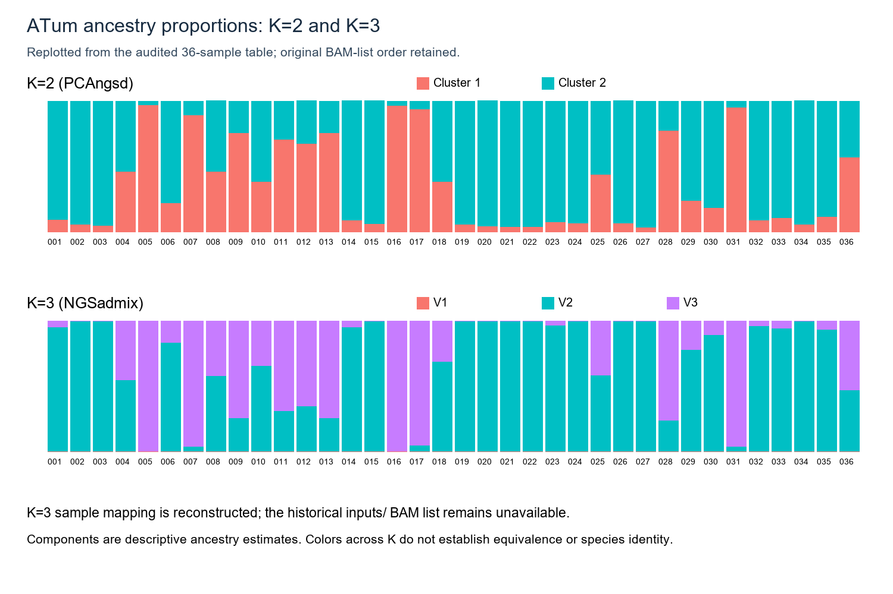
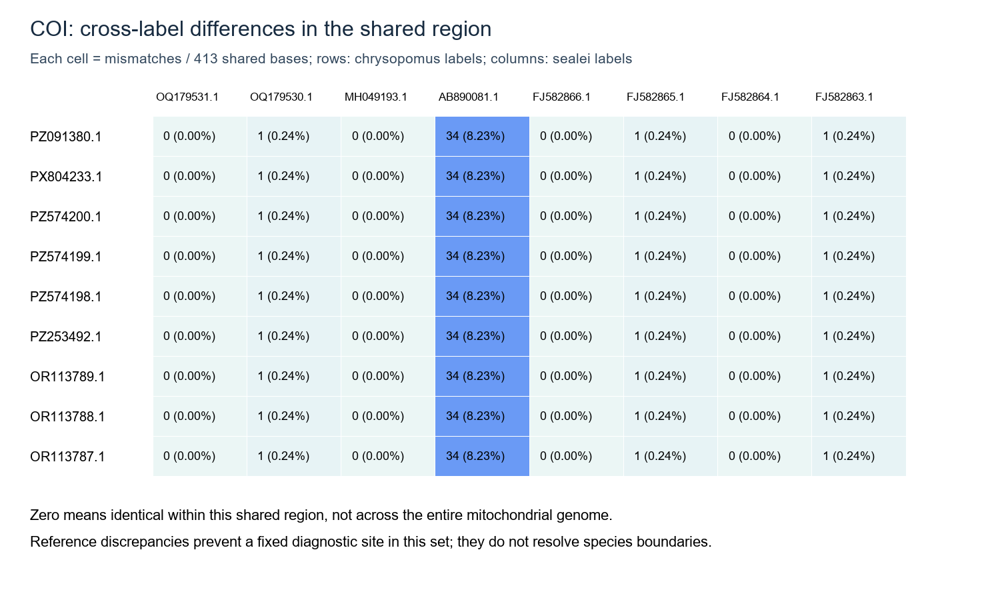

# Species identity: *Ostorhinchus chrysopomus* and *O. sealei*

## Question and samples

The thesis focuses on *O. chrysopomus*. This investigation asks whether the distinct ancestry patterns of four historical Tumindao individuals reflect species identity or another source of variation. The samples of interest are `ATum005`, `ATum016`, `ATum017`, and `ATum031`. Their identities remain unresolved. The evidence summarized below was supplied for this documentation draft; source records, analysis files, and citations still need to be linked and checked in this repository.

## Evidence and limits

- **Museum records:** Historical Tumindao adults were identified as *O. chrysopomus*; some juveniles may have been *O. sealei*. The adult and juvenile labels cannot currently be linked to individual ATum IDs. Record the original catalog entries and any specimen-to-sequence links before making an individual assignment.
- **Ancestry:** The four individuals appear unusual in examined K=2 and K=3 ancestry outputs. The underlying run, input set, plots, and parameters need to be linked here. Ancestry clusters do not identify species. The K=3 pattern is questionable and cannot support a third biological group without independent verification.
- **GenBank / mtDNA:** A preliminary comparison of available COI and 16S sequences found no universally diagnostic site separating the two named species. Accession selection, identification, homologous regions, alignment, and comparison methods need to be documented before treating that observation as a result. COI or 16S cannot currently be claimed to identify these four fish.
- **Literature search:** Mabuchi, Okuda & Nishida (2006) used mitochondrial 12S–tRNA-Val–16S for *Ostorhinchus* phylogenetics, but did not molecularly sample both focal species in that analysis. Mabuchi et al. (2014) used mitochondrial 12S–tRNA-Val–16S and COI and nuclear RAG1 and ENC1 in a broader apogonid phylogeny; inclusion of both focal species as molecularly sampled taxa needs verification. Fraser (1998) discusses the two species taxonomically and morphologically; it is not an mtDNA phylogeny. No peer-reviewed study has yet been identified here that demonstrates reciprocal mitochondrial monophyly of molecularly sampled *O. chrysopomus* and *O. sealei*. Add full bibliographic details and check the original specimen tables before citing these claims.

## Supplied figures

**ATum ancestry:** A supplied replot for 36 historical Tumindao samples labels K=2 as PCAngsd and K=3 as NGSadmix. Its caption says the K=2 ordering retains the original BAM-list order, while the K=3 sample mapping was reconstructed because its historical inputs/BAM list were unavailable. Colors across K are not equivalent species labels. Verify the input table, sample order, parameters, and plotting code before using the K=3 pattern as evidence.

**COI comparison:** A supplied figure reports mismatch counts between sequences labeled *O. chrysopomus* and *O. sealei* over 413 shared bases. Some cross-label pairs show zero mismatches within that region, while one *O. sealei*-labeled accession differs by 34 bases from each displayed *O. chrysopomus*-labeled sequence. These are values printed on the supplied image, not independently reproduced results. Verify accession identities, homologous coordinates, alignment, and code before reporting the comparison. Zero mismatches here do not imply whole-mitogenome identity or resolve species boundaries.

## Current interpretation

Do not identify `ATum005`, `ATum016`, `ATum017`, or `ATum031` as *O. sealei* on ancestry evidence alone. Species identity remains unresolved. Incomplete lineage sorting, mitochondrial introgression, hybridization, and specimen or database misidentification are possible explanations for overlapping mtDNA variation, **not findings**. Evaluate them only with appropriate independent evidence.

## Potential next analyses

1. Curate mitochondrial accessions with verified taxon labels, voucher information, source records, and homologous regions for both species.
2. Align homologous COI sequences and calculate pairwise distances, retaining accession-to-sequence provenance.
3. Construct an exploratory phylogeny or haplotype analysis, documenting alignment, model or method, outgroups, support, and limitations.
4. If suitable historical mitochondrial reads or sequences exist, compare them with curated references while accounting for damage, coverage, contamination, and reference bias.

These are proposed species-identity tests, not automatic species assignments. No new analysis was run for this README.

## Reproducibility and provenance

The two figures above were supplied for this documentation update. Their underlying tables, alignments, commands, scripts, and versions are not established in this repository; they should be treated as illustrative until reproduced. No accession table, alignment, or tree is established by this README. When work begins, keep an accession and voucher table, commands and versioned scripts, input manifests, parameters, logs, alignments, distance results, trees, and figures linked from this directory. Use relative links to tracked, reviewable files here (for example, a future `accessions.tsv`), and document exact project-storage paths for large inputs or outputs kept outside Git. For each figure or conclusion, record the script and command, input file versions and sample IDs, output path, QC checks, and interpretation limits. Link the source ancestry inputs, museum records, and full literature citations before upgrading the preliminary statements above.
